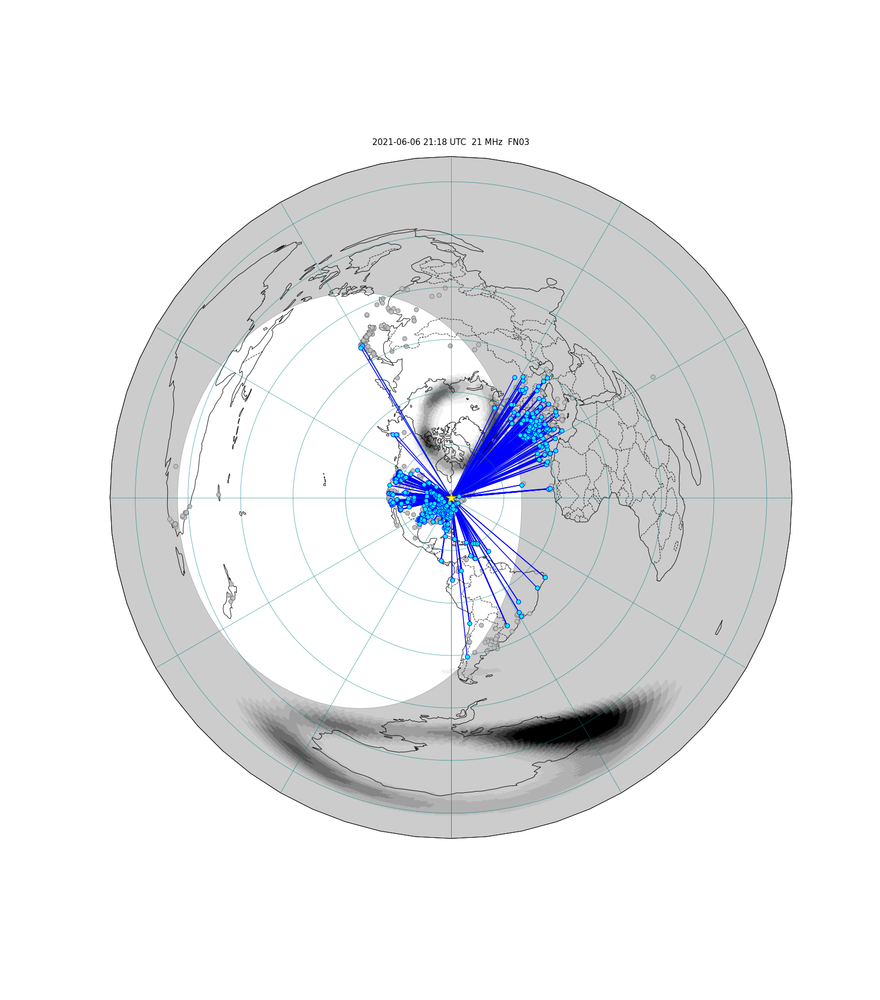

# FT8 Mapper

FT Mapper is a Jupyter notebook that downloads rea-time FT8 spots and MUF(3000) data and plots them on the same map.

## Installation

At the [git](https://git-scm.com/) prompt:
```
cd c:
mkdir ham
cd ham
git clone https://github.com/VE3NEA/ft8_mapper.git
```

At the [conda](https://docs.conda.io/en/latest/miniconda.html) prompt:
```
cd c:\ham\ft8-mapper
conda create --name ft8_map
activate ft8_map
conda install -c conda-forge --file Requirements.txt
ipython kernel install --user --name=ft8_map
```

### Execution

At the conda prompt:
```
cd c:\ham\ft8-mapper
activate ft8_map
jupyter lab
```

In Jupiter Lab double-click on ft8_mapper.ipynb

### Examples



